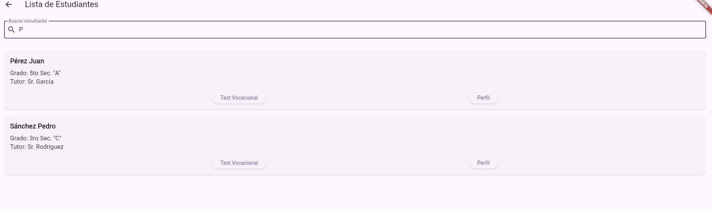
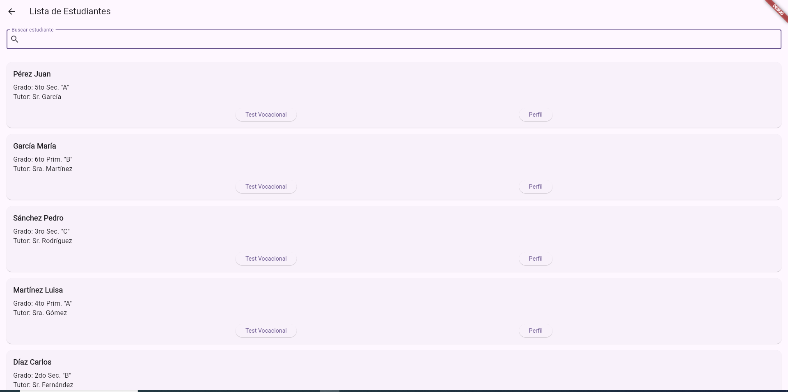
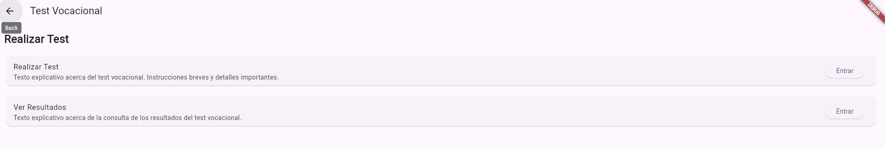
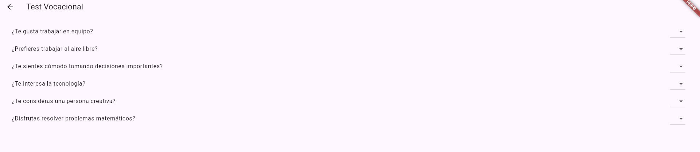
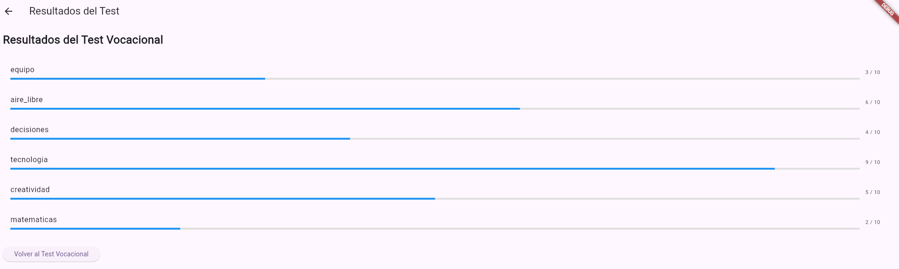

# SM2_EXAMEN_PRACTICO
Exa_Paco_Ramos_Aaron_Pedro


https://github.com/CrowProgrammer/SM2_EXAMEN_PRACTICO.git

Buscador de Perfiles de Estudiantes
El buscador de perfiles permite a los colegios acceder rápidamente a los perfiles de sus estudiantes. A través de una interfaz intuitiva, los usuarios pueden visualizar información clave de los alumnos, lo cual simplifica el proceso de seguimiento y consulta de datos académicos individuales.

Buscador que tengan P

Lista Completa



Test Vocacional Inteligente
La aplicación también incorpora un test vocacional que, mediante técnicas de machine learning, analiza las calificaciones y aptitudes registradas en el perfil de cada estudiante para generar recomendaciones personalizadas sobre posibles áreas de estudio y carreras. Esta funcionalidad ayuda a identificar las fortalezas de los estudiantes, guiando sus decisiones futuras en función de sus habilidades y rendimiento académico.

Realizar Test Vocacional

Visualizar Preguntas

Resultado



### Credenciales de Usuario Registrado
Para acceder a la aplicación, utiliza las siguientes credenciales:

```plaintext
Usuario: grupo01@gmail.com
Contraseña: 123456


### Repositorio en GitHub

Para acceder al repositorio en GitHub:

```plaintext
https://github.com/CrowProgrammer/SM2_EXAMEN_PRACTICO.git
